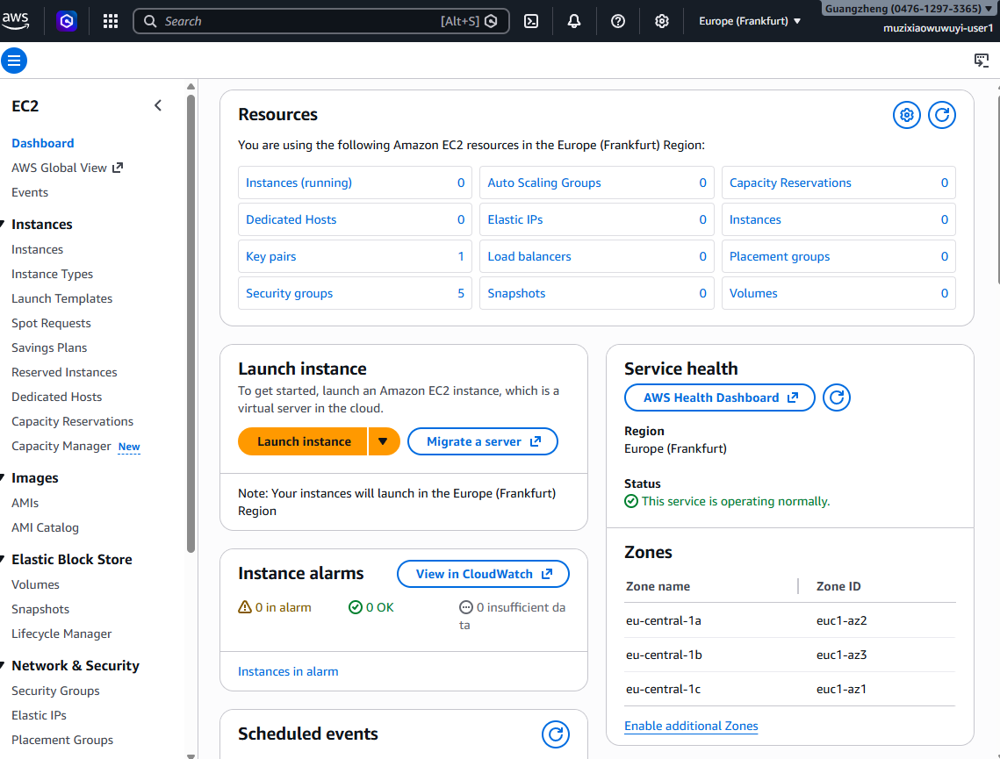
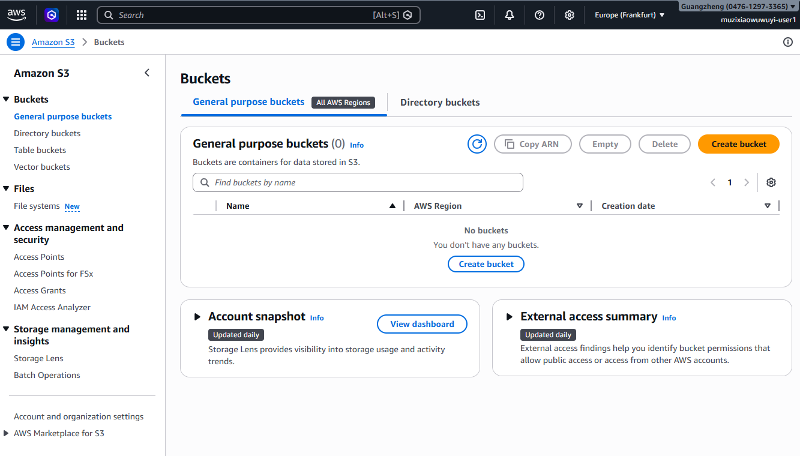
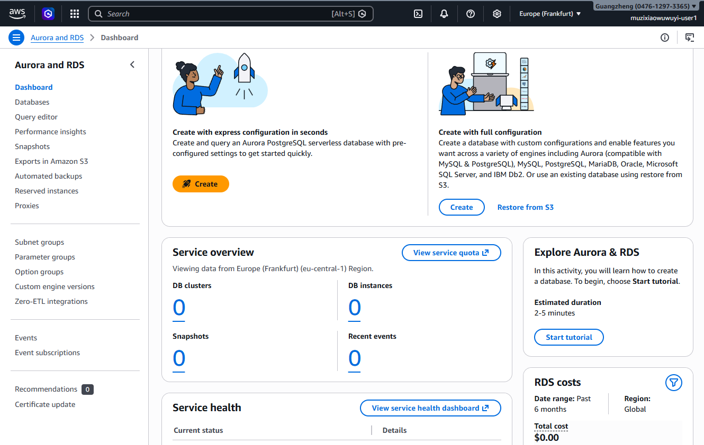
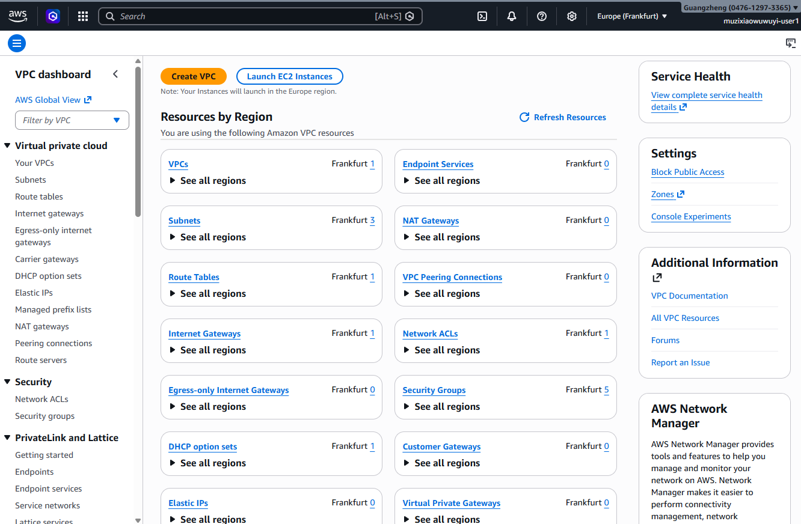
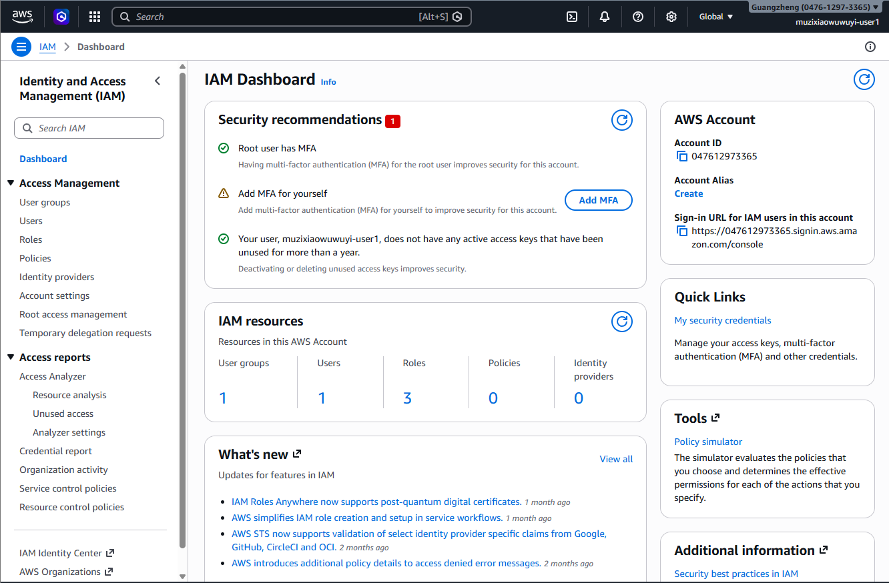
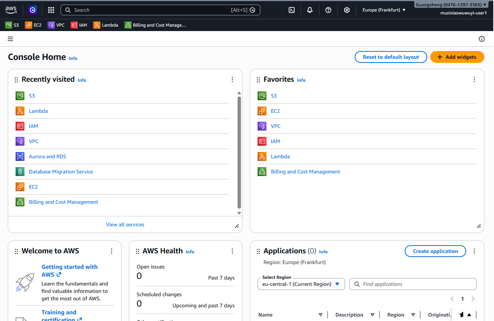
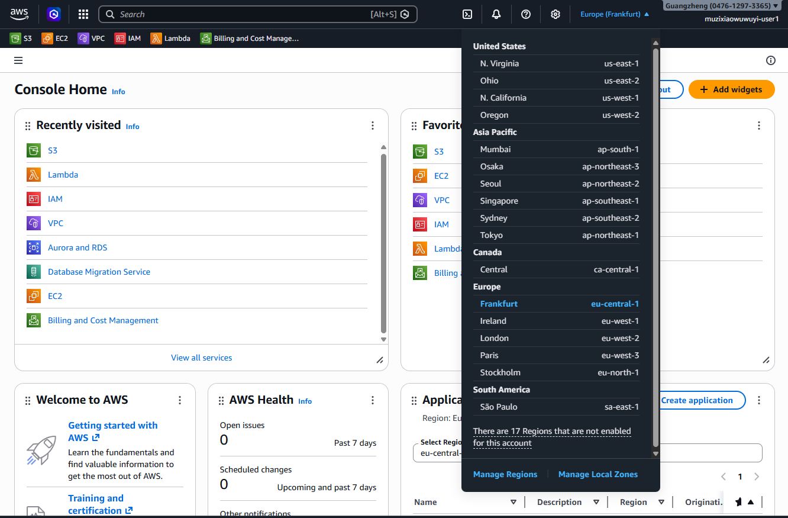
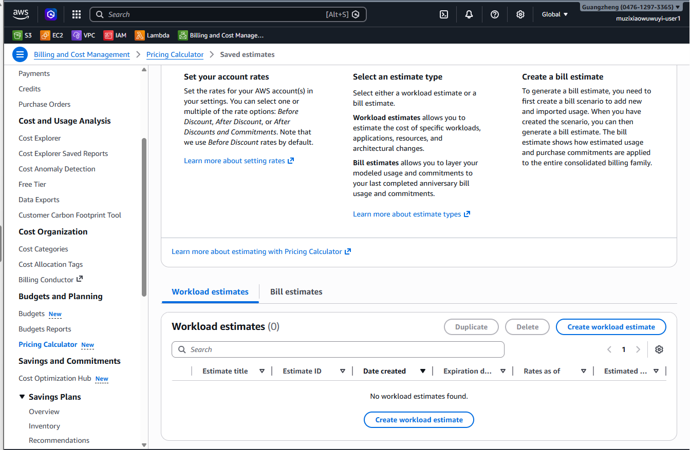

# Exploring AWS Services Lab - Solution

**Student Name:** Guangzheng Li
**Date Completed:** 20/04/2026

---

## Exercise 1: Console Navigation

### Part A: Service Discovery

**EC2 (Compute):**
- Purpose: EC2 provides resizable computing capacity in the cloud. It is used to run applications and host websites on virtual servers.
- Screenshot: 

**S3 (Storage):**
- Purpose: S3 is an object storage service. It is used for storing and retrieving any amount of data, such as images, videos, backups, and static website files.
- Screenshot: 

**RDS (Database):**
- Purpose: RDS is a managed service for relational databases. It simplifies the setup, operation, and scaling of databases like MySQL, PostgreSQL, and SQL Server.
- Screenshot: 

**VPC (Networking):**
- Purpose: VPC lets you provision a logically isolated section of the AWS Cloud. It is used to define and control a virtual network for your AWS resources.
- Screenshot: 

**IAM (Security):**
- Purpose: IAM is used to securely manage access to AWS services and resources. It allows you to create users and groups, and use permissions to allow or deny their access.
- Screenshot: 

### Part B: Console Features

**Lambda Category:** AWS Lambda belongs primarily to the Serverless Computing category, specifically under the PaaS model.

**Pinned Services:**


**Recently Visited:**


**Region Selector:**

- Original region: eu-central-1
- Changed to: eu-west-1 
- Changed back: Yes

---

## Exercise 2: Service Categorization

### Completed Service Matrix:

| Category | Services | Primary Use Case |
|----------|----------|------------------|
| Compute | EC2, Lambda, Elastic Beanstalk | Running applications |
| Storage | S3, EBS, EFS | Storing data |
| Database | RDS, DynamoDB, ElastiCache | Managing data |
| Networking | VPC, CloudFront, Route 53 | Connecting resources |
| Security | IAM, KMS, CloudTrail | Securing resources |
| Management | CloudWatch, CloudFormation, Systems Manager | Monitoring & automation |

### Research Question Answers:

**1. What's the difference between EC2 and Lambda?**

EC2 is a virtual server you manage 24/7, while Lambda is serverless code that only runs (and costs money) when triggered.

---

**2. When would you use S3 vs EBS?**

Use S3 for internet-accessible files like images and backups, and use EBS as the high-speed "hard drive" attached to an EC2 instance.

---

**3. What's the difference between RDS and DynamoDB?**

RDS is for structured, relational data (SQL), whereas DynamoDB is a fast, flexible NoSQL database for massive scale.

---

**4. Why do you need a VPC?**

A VPC provides a secure, isolated private network to host your resources and control their access to the internet.

---

**5. What does CloudWatch monitor?**

CloudWatch monitors the health and performance metrics of AWS resources, such as CPU usage, network traffic, and billing alarms.

---

## Exercise 3: AWS CLI

### CLI Version:
```
aws-cli/2.34.29 Python/3.14.3 Linux/6.17.0-20-generic exe/x86_64.ubuntu.24
```

### Configuration:
```
NAME       : VALUE                    : TYPE             : LOCATION
profile    : <not set>                : None             : None
access_key : ****************ND5R     : shared-credentials-file :
secret_key : ****************mPJc     : shared-credentials-file :
region     : eu-central-1             : config-file      : ~/.aws/config
```

### CLI Outputs:

See attached `cli-outputs.txt` file for all command outputs.

**Key findings:**
- My AWS Account ID: 047612973365
- Default region: eu-central-1  
- Number of regions available: 99

---

## Exercise 4: Pricing Research

### Pricing Worksheet:

**1. EC2 t3.micro (Linux, us-east-1):**
- On-Demand: $0.0104 per hour
- Monthly (730 hours): $7.592
- Free Tier eligible: Yes
- Free Tier details: 750/month free

**2. S3 Standard Storage:**
- 100 GB monthly cost: $2.19
- Free Tier: First 5 GB free for 12 months
- Cost per GB: $0.023

**3. RDS db.t3.micro (MySQL):**
- Monthly cost: $0.00 (covered by Free Tier)
- Storage (20 GB): $0.00 (covered by Free Tier)
- Total: $0.00 (covered by Free Tier)
- Free Tier eligible: Yes

**4. Data Transfer OUT:**
- 100 GB cost: $8.91 First 1 GB: Free Remaining 99 GB: $0.09 per GB = $8.91
- First 1 GB free per month

### AWS Pricing Calculator Estimate:



**Estimate Link:** https://us-east-1.console.aws.amazon.com/costmanagement/home#/pricing-calculator/saved-estimates

**Total Estimated Monthly Cost:** $______

---

## Exercise 5: Documentation Hunt

### EC2 Instance Types:
- Documentation URL: https://aws.amazon.com/ec2/instance-types/
- t3.medium vCPUs: 2
- t3.medium memory: 4 GB

### S3 Storage Classes:
- Documentation URL: [\[URL\]](https://aws.amazon.com/s3/storage-classes/)
- All storage classes:
  1. S3 Standard
  2. S3 Intelligent-Tiering
  3. S3 Standard-IA (Infrequent Access)
  4. S3 One Zone-IA
  5. S3 Glacier Instant Retrieval
  6. S3 Glacier Flexible Retrieval
  7. S3 Glacier Deep Archive
  8. S3 Outposts
- Cheapest for archive: S3 Glacier Deep Archive

### IAM Best Practices:
- Documentation URL: [\[URL\]](https://docs.aws.amazon.com/IAM/latest/UserGuide/best-practices.html)
- Three best practices:
  1. Lock away your AWS account root user access key
  2. Require MFA
  3. Grant least privilege

### Free Tier Limits:
- Documentation URL: [\[URL\]](https://aws.amazon.com/free/)
- EC2 t2.micro hours/month: 750 hours
- S3 storage free: 5 GB

---

## Exercise 6: Regions and Availability Zones

### Your Current Region:
- Region Name: Frankfurt
- Region Code: eu-central-1
- Number of AZs: 3

### Concept Questions:

**What is the difference between a Region and an Availability Zone?**

A Region is a physical geographic location (like Frankfurt), while an Availability Zone (AZ) is one or more discrete data centers within that region.

---

**Why does AWS have multiple regions?**

Multiple regions allow customers to reduce latency by being closer to users, and to comply with local data residency laws.

---

**How many Availability Zones does each region typically have?**

Each AWS Region has a minimum of 3 Availability Zones to ensure high availability and fault tolerance.

---

**Can you deploy resources in multiple regions simultaneously?**

Yes. You can use tools like CloudFormation or Terraform to deploy identical resources across multiple regions for global redundancy.

---


### Region Selection Analysis:

| Scenario | Best Region | Reasoning |
|----------|-------------|-----------|
| Serving users primarily in Europe | eu-central-1 (Frankfurt) | Minimizes latency for European users due to physical proximity.
| Lowest cost for non-critical workloads | us-east-1 (N. Virginia) | Typically offers the lowest pricing for most AWS services. |
| GDPR compliance required | eu-central-1 (Frankfurt) | Ensures data is stored within the EU to meet data residency laws. |
| Serving users in Asia-Pacific | ap-northeast-1 (Tokyo) | Provides a high-performance hub to reach major markets in Asia. |
| Need newest AWS services | us-east-1 (N. Virginia) | This is often the first region to receive new service launches and updates. |
---

## Bonus Challenges

### Challenge 1: Cost Estimate

**Architecture:**
- 1x t3.medium EC2 (24/7)
- 1x db.t3.micro RDS (24/7)
- 50 GB S3
- 100 GB data transfer

**Estimated Monthly Cost:** $______

**Calculator Link:** [URL]

---

### Challenge 2: Service Comparison

| AWS | Azure | GCP |
|-----|-------|-----|
| EC2 | [Azure service] | [GCP service] |
| S3 | [Azure service] | [GCP service] |
| RDS | [Azure service] | [GCP service] |
| Lambda | [Azure service] | [GCP service] |

---

### Challenge 3: CLI Advanced

[Paste outputs of advanced commands here]

---

## Reflection

**What surprised you most about AWS services?**

[Your answer]

---

**Which AWS service are you most excited to learn about?**

[Your answer]

---

**How comfortable do you feel navigating the AWS Console now?**

[Your answer: Scale 1-10 and why]

---

## Checklist

- [ ] All service dashboards visited and documented
- [ ] All CLI commands executed successfully
- [ ] All pricing research completed
- [ ] All documentation URLs found
- [ ] Region analysis completed
- [ ] All screenshots captured
- [ ] All questions answered
- [ ] Work committed to Git
- [ ] Pull request created

---

**Completed By:** [Your Name]  
**Date:** [Date]
